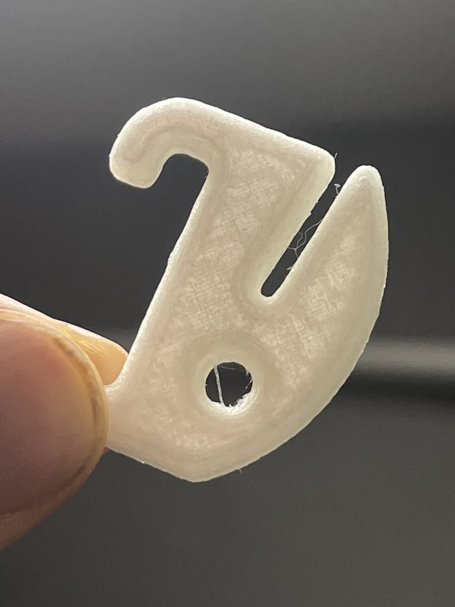
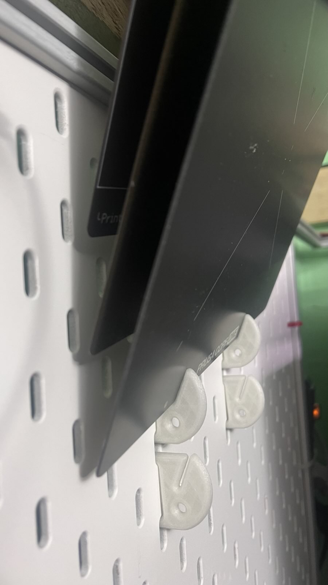

# Build Plate Holder

These clips, when used in pairs, can hold a 3D printer's build plate at a sharp angle for compact storage. Each clip has a 1.5mm slit.

## Printing Guidelines

- **Material:** Any
- **Layer height:** Standard
- **Orientation:** Print flat on the bed
- **Supports:** Not required

