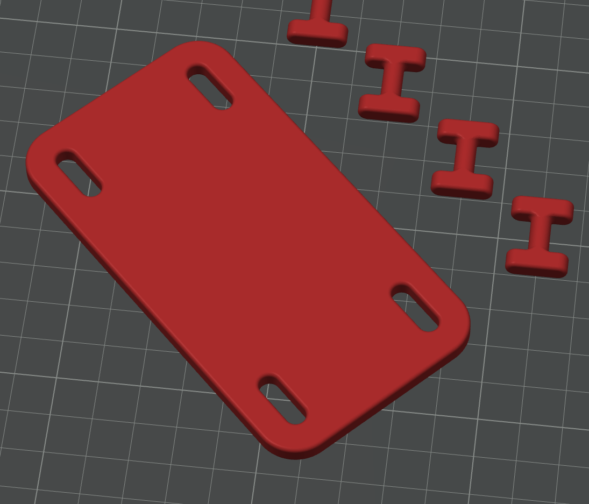
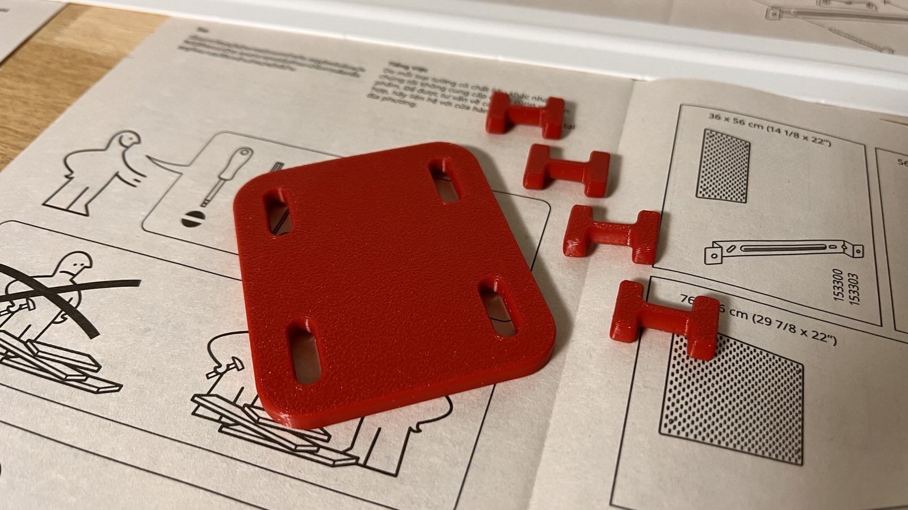
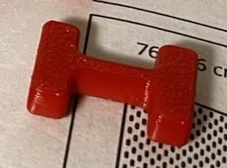

# IKEA SKÅDIS Join Plates

These join plates are designed to connect IKEA SKÅDIS pegboards together to create larger wall storage configurations.

## Available Join Plates

The collection includes two different types of join plates:

### Corner Join Plate

The corner join plate is designed to connect four SKÅDIS pegboards on a single plane at their corners. This is ideal for:

- Creating a grid layout of multiple pegboards
- Joining four pegboards at their corners
- Building larger, modular wall organization systems
- Providing additional stability at the intersection points

**Dimensions:** 110 x 60 x 5 mm

### Side Join Plate

The side join plate is designed to connect two SKÅDIS pegboards side-by-side in either horizontal or vertical orientation. This is perfect for:

- Extending your pegboard horizontally to cover larger wall areas
- Stacking pegboards vertically to utilize wall height
- Creating custom-sized storage configurations
- Joining multiple pegboards for a seamless look

**Dimensions:** 70 x 60 x 5 mm

## The SKÅDIS Keys

### Standard Key

The standard SKÅDIS key (located in the parent directory as `skadis key.step`) is an essential component for using these join plates. The key works by:

- Locking the join plates securely to the pegboard holes
- Creating a stable connection between multiple pegboards
- Preventing the join plates from becoming dislodged or disconnected
- Allowing for easy assembly and disassembly when needed

Each join plate requires SKÅDIS keys for proper installation. The key inserts into the connection point and rotates to lock the join plate in place.

### Double Key

The double SKÅDIS key (located in the parent directory as `skadis double key.step`) is designed for a special application where you need to:

- Connect join plates on both sides of a pegboard
- Create a "sandwich" configuration with the board between two plates
- Provide extra stability in high-load or specialty installations
- Create back-to-back pegboard installations

The double key has a modified design that allows it to lock plates on both sides of the pegboard simultaneously, creating a stronger connection than the standard key.

## Installation

### Standard Installation (One-Sided Connection)

1. Align the join plates with the holes in your SKÅDIS pegboards
2. Insert the standard SKÅDIS key through the join plate and into the pegboard hole
3. Turn the key 90 degrees to lock the join plate in place
4. Repeat for all connection points to ensure stability
5. Ensure all connections are tight and stable before adding accessories

### Sandwich Installation (Two-Sided Connection)

1. Align join plates on both sides of the pegboard, matching their holes
2. Insert the double SKÅDIS key through both join plates and the pegboard hole
3. Turn the key 90 degrees to lock both join plates in place
4. Repeat for all connection points to ensure maximum stability  

This creates a stronger connection ideal for heavy loads or specialized configurations

## Printing Guidelines

For best results when 3D printing these join plates:

- Use PETG, PLA+, or ABS for durability
- Print with at least 25% infill for structural integrity
- No supports needed for either design
- Layer height of 0.2mm is recommended
- Print flat on the bed

## Compatibility

These join plates are compatible with all standard IKEA SKÅDIS pegboards and use the standard SKÅDIS connection mechanism.

## Files

- **corner join plate.step** - STEP file for the four-way corner connector
- **side join plate.step** - STEP file for the horizontal/vertical side connector
- **../skadis key.step** - STEP file for the standard key used to lock join plates to the pegboards
- **../skadis double key.step** - STEP file for the double key used to connect join plates on both sides of a pegboard

For more information about other SKÅDIS accessories, see the main [repository documentation](../../../README.md).
