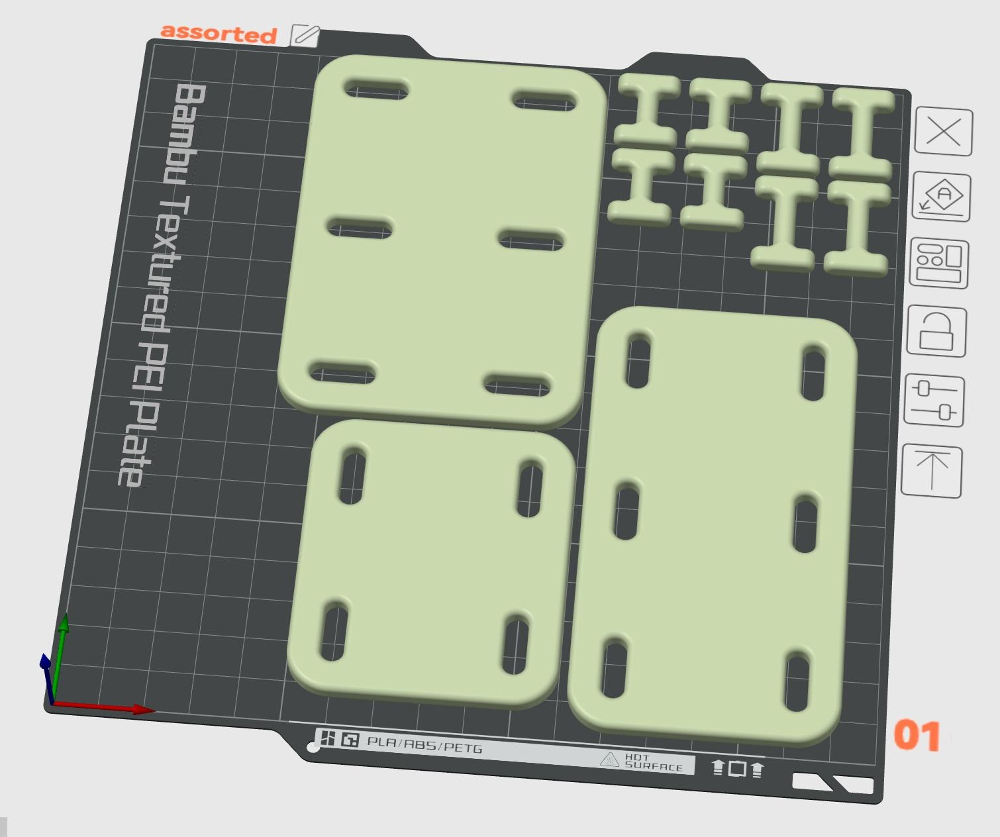
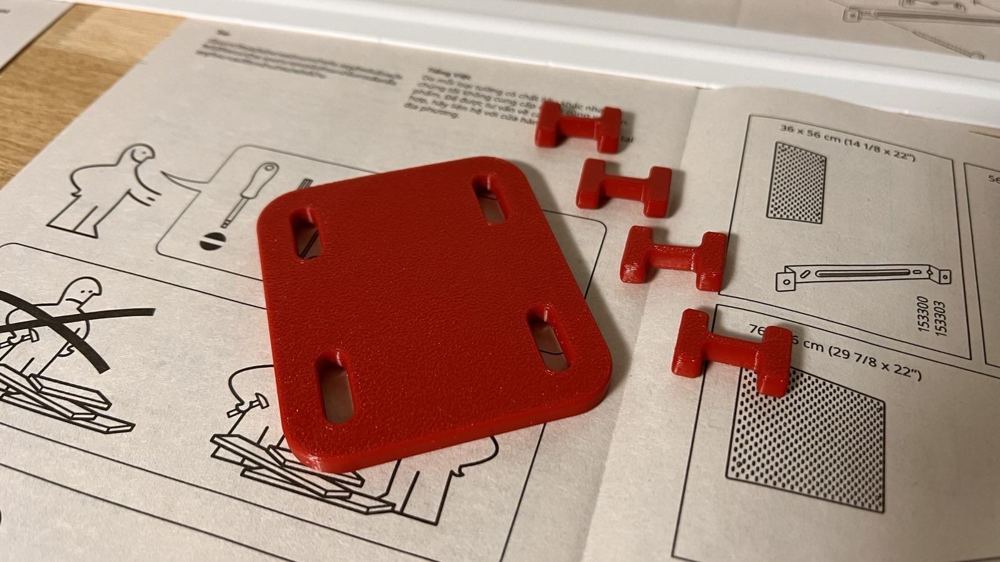
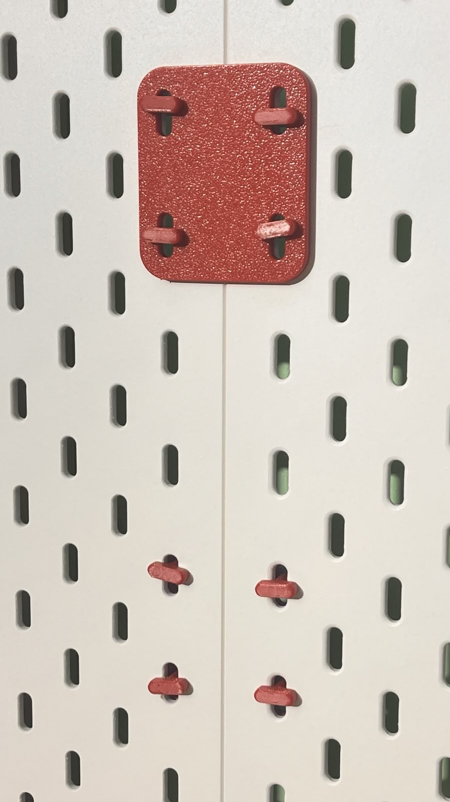
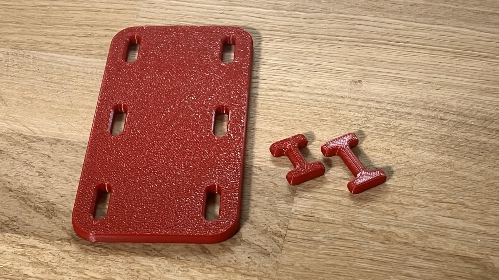
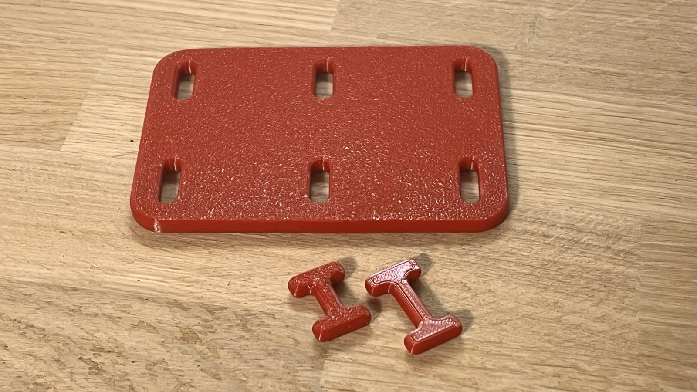
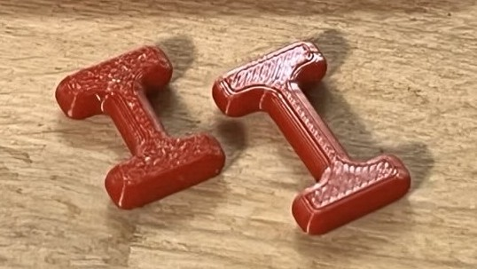

# IKEA SKÅDIS Join Plates

These join plates are designed to connect IKEA SKÅDIS pegboards together to create larger wall storage configurations.

*All join plate variants and keys laid out on a single build plate for efficient printing*

## Available Join Plates

The collection includes three different types of join plates:

### Square Join Plate

The square join plate is designed to connect two SKÅDIS pegboards side-by-side in either horizontal or vertical orientation. This is perfect for:

- Extending your pegboard horizontally to cover larger wall areas
- Stacking pegboards vertically to utilize wall height
- Creating custom-sized storage configurations
- Joining multiple pegboards for a seamless look

*Square join plate installed between two SKÅDIS pegboards*

**Dimensions:** 70 x 60 x 5 mm

### Corner Join Plates - Portrait (P) and Landscape (L) Variations

The corner join plates now come in two orientation variations - Portrait (P) and Landscape (L) - to provide more flexibility in how you connect your SKÅDIS pegboards. These plates are designed to connect four SKÅDIS pegboards on a single plane at their corners and are ideal for:

- Creating a grid layout of multiple pegboards
- Joining four pegboards at their corners
- Building larger, modular wall organization systems
- Providing additional stability at the intersection points
- Accommodating different mounting configurations based on your space constraints

**Dimensions:**

- Portrait (P): 110 x 60 x 5 mm
- Landscape (L): 70 x 100 x 5 mm

## The SKÅDIS Keys

### Standard Key

The standard SKÅDIS key (located in the parent directory as `skadis key - normal.step`) is an essential component for using these join plates. The key works by:

- Locking the join plates securely to the pegboard holes
- Creating a stable connection between multiple pegboards
- Preventing the join plates from becoming dislodged or disconnected
- Allowing for easy assembly and disassembly when needed

Each join plate requires SKÅDIS keys for proper installation. The key inserts into the connection point and rotates to lock the join plate in place.

### Double Key

The double SKÅDIS key (located in the parent directory as `skadis key - double.step`) is designed for a special application where you need to:

- Connect join plates on both sides of a pegboard
- Create a "sandwich" configuration with the board between two plates
- Provide extra stability in high-load or specialty installations
- Create back-to-back pegboard installations

The double key has a modified design that allows it to lock plates on both sides of the pegboard simultaneously, creating a stronger connection than the standard key.

## Installation

### Standard Installation (One-Sided Connection)

1. Align the join plates with the holes in your SKÅDIS pegboards
2. Insert the standard SKÅDIS key through the join plate and into the pegboard hole
3. Turn the key 90 degrees to lock the join plate in place
4. Repeat for all connection points to ensure stability
5. Ensure all connections are tight and stable before adding accessories

### Sandwich Installation (Two-Sided Connection)

1. Align join plates on both sides of the pegboard, matching their holes
2. Insert the double SKÅDIS key through both join plates and the pegboard hole
3. Turn the key 90 degrees to lock both join plates in place
4. Repeat for all connection points to ensure maximum stability  

This creates a stronger connection ideal for heavy loads or specialized configurations

## Printing Guidelines

For best results when 3D printing these join plates:

- Use PCTG (preferred), PETG, PLA+, or ABS for durability
- Print with 15% infill (standard default is sufficient)
- 4 perimeters for optimal strength
- 8 top and bottom layers for solid surfaces
- No supports needed
- Layer height of 0.2mm is recommended
- **Arachne Wall Generator**: Enable if your slicer supports it (PrusaSlicer/SuperSlicer/OrcaSlicer) for stronger, more consistent extrusion around the curved contours
- **Seam Position**: Set to "Random" in your slicer for optimal strength (prevents creating a single weak point)
- Print flat on the bed

### Recommended Filament Suppliers

PCTG is strongly recommended for these parts due to its excellent balance of durability, impact resistance, and ease of printing.

**Europe:**

- [Extrudr PCTG](https://www.extrudr.com/en/inlt/products/pctg/) - High-quality filaments with consistent diameter and excellent layer adhesion
- [Fiberlogy PCTG](https://fiberlogy.com/en/fiberlogy-filaments/pctg/) - High-quality PCTG with excellent transparency and color options

**United States:**

- [Fusion Filaments PCTG](https://www.fusionfilaments.com/shop/category/pctg-24)
- [Printed Solid by Jessie PCTG](https://www.printedsolid.com/collections/1-75mm-filament/material_pctg)
- [MatterHackers Pro PCTG](https://www.matterhackers.com/s/store?q=pctg)
- [3D Fuel Pro PCTG](https://www.3dfuel.com/collections/1-75mm-pro-pctg/)

If PCTG is unavailable, PETG is a good alternative, though it may be slightly less impact resistant.

## Compatibility

These join plates are compatible with all standard IKEA SKÅDIS pegboards and use the standard SKÅDIS connection mechanism.

## Files

- **join plate - square.step** - STEP file for the square join plate (for side-by-side connections)
- **join plate - portrait.step** - STEP file for the Portrait (P) corner join plate
- **join plate - landscape.step** - STEP file for the Landscape (L) corner join plate
- **../skadis key - normal.step** - STEP file for the standard key used to lock join plates to the pegboards
- **../skadis key - double.step** - STEP file for the double key used to connect join plates on both sides of a pegboard

For more information about other SKÅDIS and/or 2020 accessories, see the main [repository documentation](https://github.com/mitselek/ikea-skadis-meets-2020).
